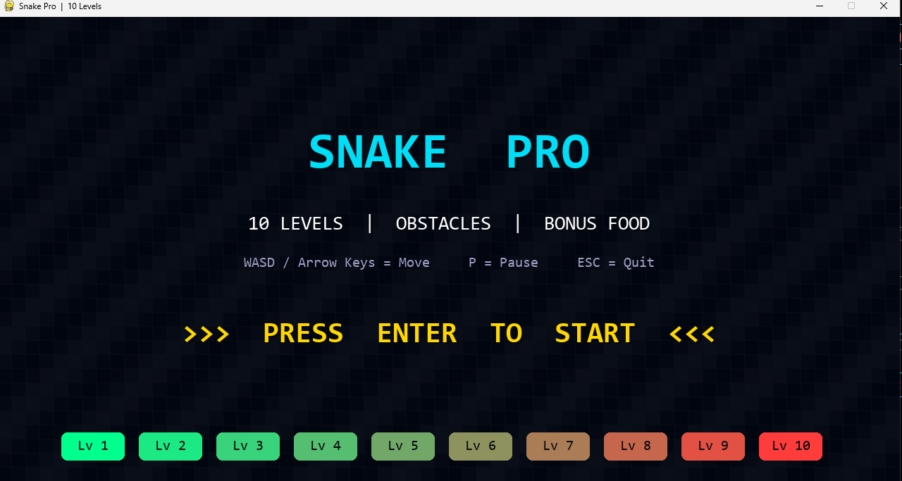
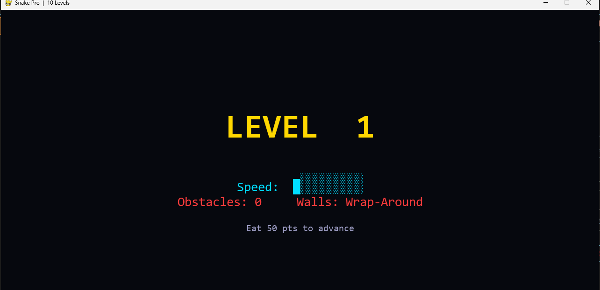
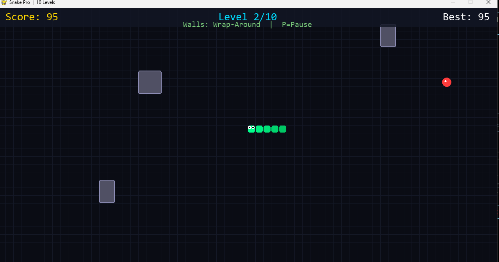
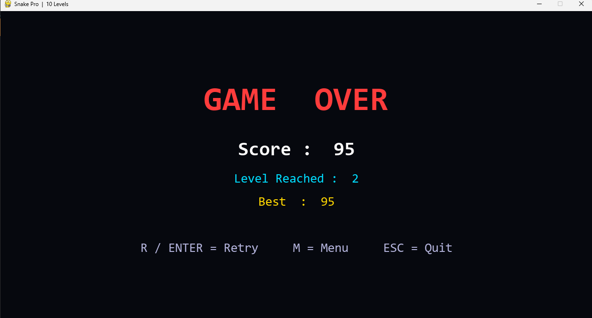

<========== 🐍 Snake Pro | 10 Levels  ==========>

<p align="center">
  <a href="https://github.com/MerrimentSaini">
    
  </a>
  <a href="https://www.linkedin.com/in/avi-saini-15956b214/">
    
  </a>
</p>


<===== 📌 Project Overview =====>

**Snake Pro** is an advanced version of the classic Snake Game developed using **Python** and **Pygame**. Unlike the traditional snake game, this version introduces **10 progressive levels**, increasing difficulty, dynamic obstacles, bonus food, speed progression, score tracking, and an attractive modern gaming interface.

The game has been designed with a clean UI and smooth gameplay to provide an engaging experience while demonstrating game development concepts using Python.


<===== ✨ Features=====>

-> 🎮 10 Progressive Levels
-> 🚀 Increasing Snake Speed
-> 🧱 Dynamic Obstacles
-> 🍎 Food Collection System
-> ⭐ Bonus Food
-> 📈 Automatic Level Progression
-> 🏆 High Score Saving
-> ⏸ Pause & Resume Functionality
-> 🔄 Retry Game
-> 🖥 Modern User Interface
-> 🎨 Beautiful Start Screen
-> 💀 Professional Game Over Screen
-> 🌐 Wrap Around Walls .


<===== 🛠 Tech Stack =====>

-> Python
-> Pygame Library
-> Random Module
-> Math Module
-> File Handling (High Score)
-> Object-Oriented Programming Concepts


<===== 🎮 Controls =====>

| Key | Action |
|------|--------|
| ↑ ↓ ← → | Move Snake |
| W A S D | Alternative Movement |
| P | Pause / Resume |
| ENTER | Start / Retry |
| M | Return to Menu |
| ESC | Quit Game |


<===== 📷 Project Screenshots =====>

<----- 🏠 Home Screen ----->




<----- 🎯 Level Information ----->




<----- 🎮 Gameplay ----->




<----- 💀 Game Over Screen ----->




<----- 🎯 Game Progression ----->

| Level | Difficulty | Features |
|--------|------------|-----------|
| Level 1 | Easy | Wrap Around |
| Level 2 | Easy | Small Obstacles |
| Level 3 | Medium | Faster Snake |
| Level 4 | Medium | More Obstacles |
| Level 5 | Medium | Increased Speed |
| Level 6 | Hard | Complex Layout |
| Level 7 | Hard | Bonus Food |
| Level 8 | Hard | Dense Obstacles |
| Level 9 | Expert | High Speed |
| Level 10 | Extreme | Ultimate Challenge |


<========== 📂 Project Structure ==========>

```
SnakePro/
│
├──Game_Source_Code
|   ├── SnakeGame.py
├── Screenshots/
│   ├── HomePage.png
│   ├── Level.png
│   ├── GamePlay.png
│   └── GameOver.png
│
└── README.md

<==========💡 Learning Outcomes ==========>

This project helped strengthen my understanding of:

-> Python Programming
-> Pygame Development
-> Game Loop Logic
-> Collision Detection
-> File Handling
-> Event Handling
-> UI Design
-> Game State Management
-> Object-Oriented Programming
-> Performance Optimization


<========== 🚀 Future Enhancements ==========>

-> Multiplayer Mode
-> Different Snake Skins
-> Leaderboard System
-> Power-Ups
-> Save & Continue
-> Difficulty Selection
-> Mobile Version
-> AI Snake Mode

<===== 🙋 Author =====>

Avi Saini

📧 Passionate Python Developer & Data Analyst Aspirant

<========== ⭐ If you like this project ==========>

Please consider giving this repository a **Star ⭐** on GitHub. Your support motivates me to build more exciting Python projects. Thanks..!
